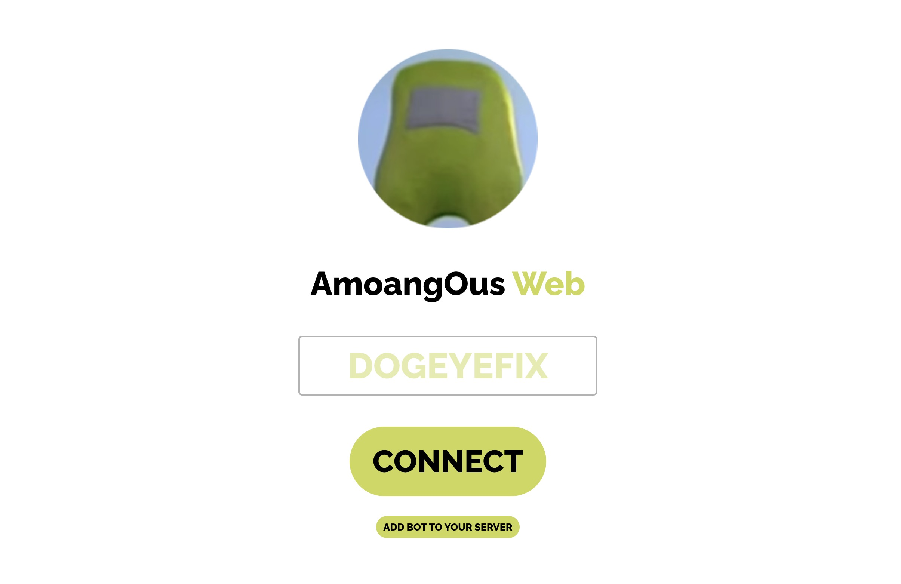
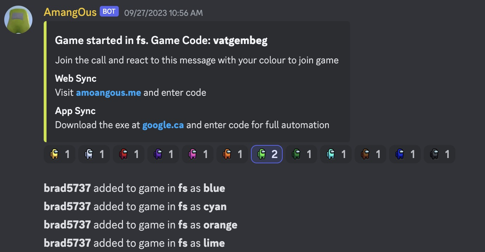

<!-- PROJECT LOGO -->
 

  

  <h3 align="center">Amoang Ous Bot</h3>

  

    A discord bot that automatically mutes all users during among us games
  

## Use
Visit [amoangous.com](https://amoangous.com/)

## About The Project
This is a discord bot that you can [add here](https://amoangous.com/). This bot interacts with the [web control](https://github.com/WilliamJChen/AmonagOusWebControl), aswell as the desktop client, that will automatically mute and unmute depending on game state.

The bot can keep track of dead and alive players

### Built With
* [Discord.js](https://discord.js.org/#/)
* [socket.io](https://socket.io/)

<!-- GETTING STARTED -->
## Getting Started and Usage
All you have to do is add the bot to you server. Then type `?start` in the discord chat.
